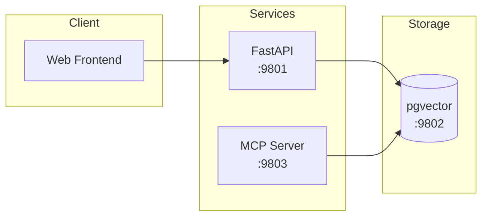

# Straight Retrieve


A RAG (Retrieval-Augmented Generation) application with document upload, hierarchical splitting, vector storage, and MCP-based search.

## Architecture



## Ports

| Service    | Port | Description                          |
|------------|------|--------------------------------------|
| API        | 9801 | FastAPI + Web Frontend               |
| PostgreSQL | 9802 | pgvector database (internal 5432)    |
| MCP        | 9803 | MCP Server (streamable-http)         |

## Quick Start

1. **Copy environment file:**
   ```bash
   cp .env.example .env
   ```

2. **Configure Ollama host** (edit `.env`):
   ```env
   OLLAMA_HOST=http://172.17.0.1:11434
   ```
   Use `172.17.0.1` for Docker's host gateway, or your actual host IP.

3. **Start services:**
   ```bash
   docker compose up -d
   ```

4. **Access the web interface:**
   Open http://localhost:9801

## Features

- **Document Upload**: PDF, EPUB, DOCX, Markdown, and text files
- **Hierarchical Splitting**: Split by markdown headers, then by chunk size
- **Vector Storage**: LangGraph AsyncPostgresStore with pgvector
- **Deduplication**: Content-hash based document IDs prevent duplicates
- **Parallel Processing**: Chunks are embedded concurrently using asyncio
- **MCP Integration**: Search tool compatible with langmem `search_memory` signature

## MCP Configuration

Add to your MCP client configuration:

```json
{
  "$schema": "https://opencode.ai/config.json",
  "mcp": {
    "straight retrieve": {
      "type": "remote",
      "url": "http://localhost:9803/mcp/",
      "enabled": true
    }
  }
}
```

### Available MCP Tools

| Tool | Description |
|------|-------------|
| `search_memory` | Vector similarity search across documents |
| `list_namespaces` | List available namespaces in the store |
| `get_item` | Retrieve a specific item by namespace and key |

### search_memory Parameters

```python
search_memory(
    query: str,           # Search query
    limit: int = 10,      # Max results
    offset: int = 0,      # Skip results
    filter: dict = None,  # Filter criteria (e.g., {"document_id": "abc123"})
    namespace: list = None  # Custom namespace (default: ["rag", "chunks"])
)
```

## API Endpoints

### Upload
- `POST /api/upload` - Upload document (multipart form)

### Documents
- `GET /api/documents` - List all documents
- `GET /api/documents/{id}` - Get document details with chunks
- `DELETE /api/documents/{id}` - Delete document and its chunks

### Search
- `POST /api/search` - Vector similarity search

### Health
- `GET /api/status` - Health check

## Configuration

Environment variables (`.env`):

```env
# Database
POSTGRES_USER=raguser
POSTGRES_PASSWORD=ragpassword
POSTGRES_DB=ragdb

# Embeddings (Ollama)
OLLAMA_HOST=http://172.17.0.1:11434
OLLAMA_EMBED_MODEL=qwen3-embedding:0.6b
EMBEDDING_DIMENSION=1024

# Chunking (optional)
CHUNK_SIZE=1000
CHUNK_OVERLAP_RATIO=0.1

# Search (optional)
DEFAULT_SEARCH_LIMIT=5
```

## Project Structure

```
mmxxvi_straight_retrieve/
├── docker-compose.yaml
├── .env.example
├── api/
│   ├── Dockerfile
│   ├── requirements.txt
│   ├── main.py
│   ├── config.py
│   ├── store.py
│   ├── routers/
│   │   ├── upload.py
│   │   ├── documents.py
│   │   └── search.py
│   ├── services/
│   │   └── ingestion.py
│   └── models/
│       └── schemas.py
├── mcp/
│   ├── Dockerfile
│   ├── requirements.txt
│   └── server.py
├── frontend/
│   ├── index.html
│   ├── styles.css
│   └── app.js
└── init/
    └── init.sql
```

## Development

Rebuild containers after code changes:
```bash
docker compose up -d --build
```

View logs:
```bash
docker compose logs -f api
docker compose logs -f mcp
```

Reset database:
```bash
docker compose down -v
docker compose up -d
```
